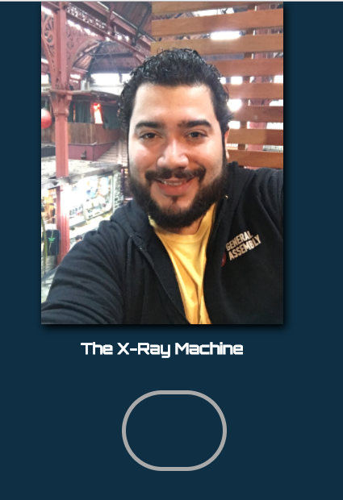

# The X-Ray experiment

[Link Here](https://rapala61.github.io/xrayme/)

## How it started
I was just trying to get an idea into code. The idea was to have my original picture which would show my X-ray version as I would hover over it.

Initially, I brute forced my way into making it work. Later, I refactored it and used ES6 syntax and OO principles with classes.

## Technologies
- JavaScript ES6
- jQuery
- Underscore.js

## Future
- BDD Testing
- Different versions (branches):
  - React.js
  - Angular2
